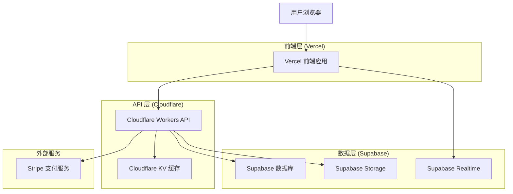
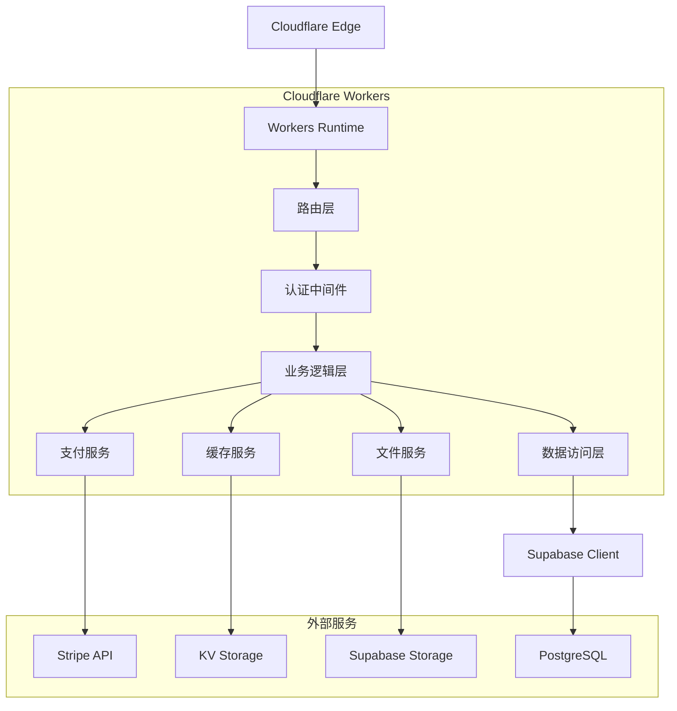
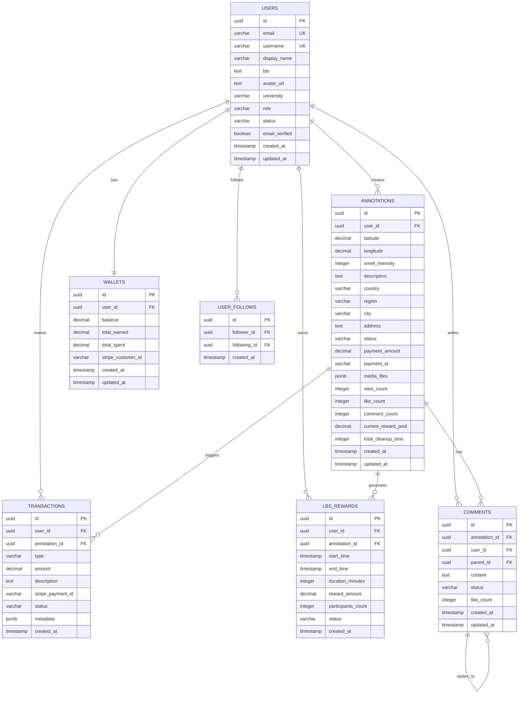

# SmellPin 技术架构文档 - Cloudflare Workers + Supabase + Vercel

## 1. 架构设计



## 2. 技术描述

- **前端**: React@19 + TypeScript + Vite + Tailwind CSS + Supabase Client
- **API**: Cloudflare Workers + TypeScript + Supabase SDK
- **数据库**: Supabase (PostgreSQL) + Row Level Security
- **存储**: Supabase Storage
- **实时通信**: Supabase Realtime
- **缓存**: Cloudflare KV Storage
- **支付**: Stripe API
- **部署**: Vercel (前端) + Cloudflare Workers (API)

## 3. 路由定义

| 路由 | 用途 | 组件 |
|------|------|------|
| / | 首页，显示地图和标注 | HomePage |
| /login | 登录页面 | LoginPage |
| /register | 注册页面 | RegisterPage |
| /profile | 用户个人资料页面 | ProfilePage |
| /wallet | 钱包管理页面 | WalletPage |
| /annotations/:id | 标注详情页面 | AnnotationDetailPage |
| /leaderboard | 排行榜页面 | LeaderboardPage |
| /admin | 管理后台 | AdminDashboard |

## 4. API 定义

### 4.1 核心 API

#### 用户认证相关

**用户注册**
```
POST /api/auth/register
```

Request:
| 参数名 | 参数类型 | 是否必需 | 描述 |
|--------|----------|----------|------|
| email | string | true | 用户邮箱 |
| password | string | true | 密码 |
| username | string | true | 用户名 |
| university | string | false | 大学名称 |

Response:
| 参数名 | 参数类型 | 描述 |
|--------|----------|------|
| success | boolean | 注册是否成功 |
| user | object | 用户信息 |
| session | object | 会话信息 |

Example:
```json
{
  "email": "user@example.com",
  "password": "securepassword",
  "username": "cooluser",
  "university": "Stanford University"
}
```

**用户登录**
```
POST /api/auth/login
```

Request:
| 参数名 | 参数类型 | 是否必需 | 描述 |
|--------|----------|----------|------|
| email | string | true | 用户邮箱 |
| password | string | true | 密码 |

Response:
| 参数名 | 参数类型 | 描述 |
|--------|----------|------|
| success | boolean | 登录是否成功 |
| user | object | 用户信息 |
| session | object | 会话信息 |

#### 标注管理相关

**创建标注**
```
POST /api/annotations
```

Request:
| 参数名 | 参数类型 | 是否必需 | 描述 |
|--------|----------|----------|------|
| latitude | number | true | 纬度 |
| longitude | number | true | 经度 |
| smell_intensity | number | true | 臭味强度 (1-10) |
| description | string | false | 描述 |
| payment_amount | number | true | 支付金额 |
| media_files | array | false | 媒体文件数组 |

Response:
| 参数名 | 参数类型 | 描述 |
|--------|----------|------|
| success | boolean | 创建是否成功 |
| annotation | object | 标注信息 |
| client_secret | string | Stripe 客户端密钥 |

**获取标注列表**
```
GET /api/annotations
```

Query Parameters:
| 参数名 | 参数类型 | 是否必需 | 描述 |
|--------|----------|----------|------|
| lat | number | false | 中心纬度 |
| lng | number | false | 中心经度 |
| radius | number | false | 搜索半径(米) |
| page | number | false | 页码 |
| limit | number | false | 每页数量 |

Response:
| 参数名 | 参数类型 | 描述 |
|--------|----------|------|
| success | boolean | 请求是否成功 |
| annotations | array | 标注列表 |
| pagination | object | 分页信息 |

#### LBS 奖励相关

**开始位置追踪**
```
POST /api/lbs/start-tracking
```

Request:
| 参数名 | 参数类型 | 是否必需 | 描述 |
|--------|----------|----------|------|
| annotation_id | string | true | 标注ID |
| latitude | number | true | 当前纬度 |
| longitude | number | true | 当前经度 |

Response:
| 参数名 | 参数类型 | 描述 |
|--------|----------|------|
| success | boolean | 开始追踪是否成功 |
| session_id | string | 追踪会话ID |
| reward_rate | number | 奖励费率 |

**停止位置追踪**
```
POST /api/lbs/stop-tracking
```

Request:
| 参数名 | 参数类型 | 是否必需 | 描述 |
|--------|----------|----------|------|
| session_id | string | true | 追踪会话ID |

Response:
| 参数名 | 参数类型 | 描述 |
|--------|----------|------|
| success | boolean | 停止追踪是否成功 |
| total_reward | number | 总奖励金额 |
| duration | number | 总时长(分钟) |

#### 支付相关

**创建支付意图**
```
POST /api/payments/create-intent
```

Request:
| 参数名 | 参数类型 | 是否必需 | 描述 |
|--------|----------|----------|------|
| amount | number | true | 支付金额 |
| type | string | true | 支付类型 |
| metadata | object | false | 元数据 |

Response:
| 参数名 | 参数类型 | 描述 |
|--------|----------|------|
| success | boolean | 创建是否成功 |
| client_secret | string | 客户端密钥 |
| payment_intent_id | string | 支付意图ID |

#### 文件上传相关

**上传文件**
```
POST /api/upload
```

Request (multipart/form-data):
| 参数名 | 参数类型 | 是否必需 | 描述 |
|--------|----------|----------|------|
| file | File | true | 文件对象 |
| bucket | string | true | 存储桶名称 |
| folder | string | false | 文件夹路径 |

Response:
| 参数名 | 参数类型 | 描述 |
|--------|----------|------|
| success | boolean | 上传是否成功 |
| url | string | 文件公共URL |
| path | string | 文件路径 |

### 4.2 TypeScript 类型定义

```typescript
// 用户类型
interface User {
  id: string;
  email: string;
  username: string;
  display_name?: string;
  bio?: string;
  avatar_url?: string;
  university?: string;
  role: 'user' | 'moderator' | 'admin';
  status: 'active' | 'suspended' | 'deleted';
  email_verified: boolean;
  created_at: string;
  updated_at: string;
}

// 标注类型
interface Annotation {
  id: string;
  user_id: string;
  latitude: number;
  longitude: number;
  smell_intensity: number;
  description?: string;
  country?: string;
  region?: string;
  city?: string;
  address?: string;
  status: 'active' | 'hidden' | 'deleted';
  payment_amount: number;
  payment_id?: string;
  media_files: string[];
  view_count: number;
  like_count: number;
  comment_count: number;
  current_reward_pool: number;
  total_cleanup_time: number;
  created_at: string;
  updated_at: string;
  user?: User;
}

// 钱包类型
interface Wallet {
  id: string;
  user_id: string;
  balance: number;
  total_earned: number;
  total_spent: number;
  stripe_customer_id?: string;
  created_at: string;
  updated_at: string;
}

// 交易类型
interface Transaction {
  id: string;
  user_id: string;
  annotation_id?: string;
  type: 'payment' | 'reward' | 'withdrawal' | 'refund';
  amount: number;
  description?: string;
  stripe_payment_id?: string;
  status: 'pending' | 'completed' | 'failed' | 'cancelled';
  metadata: Record<string, any>;
  created_at: string;
}

// LBS 奖励类型
interface LBSReward {
  id: string;
  user_id: string;
  annotation_id: string;
  start_time: string;
  end_time?: string;
  duration_minutes: number;
  reward_amount: number;
  participants_count: number;
  status: 'active' | 'completed' | 'cancelled';
  created_at: string;
}

// API 响应类型
interface ApiResponse<T = any> {
  success: boolean;
  data?: T;
  error?: {
    code: string;
    message: string;
    details?: any;
  };
  pagination?: {
    page: number;
    limit: number;
    total: number;
    totalPages: number;
  };
}
```

## 5. 服务器架构图



## 6. 数据模型

### 6.1 数据模型定义



### 6.2 数据定义语言 (DDL)

#### 用户表 (users)
```sql
-- 创建用户表
CREATE TABLE users (
    id UUID PRIMARY KEY DEFAULT gen_random_uuid(),
    email VARCHAR(255) UNIQUE NOT NULL,
    username VARCHAR(50) UNIQUE NOT NULL,
    display_name VARCHAR(100),
    bio TEXT,
    avatar_url TEXT,
    university VARCHAR(100),
    role VARCHAR(20) DEFAULT 'user' CHECK (role IN ('user', 'moderator', 'admin')),
    status VARCHAR(20) DEFAULT 'active' CHECK (status IN ('active', 'suspended', 'deleted')),
    email_verified BOOLEAN DEFAULT false,
    last_login_at TIMESTAMP WITH TIME ZONE,
    created_at TIMESTAMP WITH TIME ZONE DEFAULT NOW(),
    updated_at TIMESTAMP WITH TIME ZONE DEFAULT NOW()
);

-- 创建索引
CREATE INDEX idx_users_email ON users(email);
CREATE INDEX idx_users_username ON users(username);
CREATE INDEX idx_users_university ON users(university);
CREATE INDEX idx_users_status ON users(status);
CREATE INDEX idx_users_created_at ON users(created_at DESC);

-- 启用 RLS
ALTER TABLE users ENABLE ROW LEVEL SECURITY;

-- RLS 策略
CREATE POLICY "Users can view all profiles" ON users FOR SELECT USING (true);
CREATE POLICY "Users can update own profile" ON users FOR UPDATE USING (auth.uid() = id);

-- 权限设置
GRANT SELECT ON users TO anon;
GRANT ALL PRIVILEGES ON users TO authenticated;
```

#### 标注表 (annotations)
```sql
-- 创建标注表
CREATE TABLE annotations (
    id UUID PRIMARY KEY DEFAULT gen_random_uuid(),
    user_id UUID NOT NULL REFERENCES users(id) ON DELETE CASCADE,
    latitude DECIMAL(10, 8) NOT NULL,
    longitude DECIMAL(11, 8) NOT NULL,
    smell_intensity INTEGER NOT NULL CHECK (smell_intensity BETWEEN 1 AND 10),
    description TEXT,
    country VARCHAR(2),
    region VARCHAR(100),
    city VARCHAR(100),
    address TEXT,
    status VARCHAR(20) DEFAULT 'active' CHECK (status IN ('active', 'hidden', 'deleted')),
    payment_amount DECIMAL(10, 2) NOT NULL,
    payment_id VARCHAR(255),
    media_files JSONB DEFAULT '[]',
    view_count INTEGER DEFAULT 0,
    like_count INTEGER DEFAULT 0,
    comment_count INTEGER DEFAULT 0,
    current_reward_pool DECIMAL(10, 2) DEFAULT 0,
    total_cleanup_time INTEGER DEFAULT 0,
    created_at TIMESTAMP WITH TIME ZONE DEFAULT NOW(),
    updated_at TIMESTAMP WITH TIME ZONE DEFAULT NOW()
);

-- 创建地理索引
CREATE INDEX idx_annotations_location ON annotations USING GIST (ST_Point(longitude, latitude));
CREATE INDEX idx_annotations_user_id ON annotations(user_id);
CREATE INDEX idx_annotations_smell_intensity ON annotations(smell_intensity);
CREATE INDEX idx_annotations_city ON annotations(city);
CREATE INDEX idx_annotations_status ON annotations(status);
CREATE INDEX idx_annotations_created_at ON annotations(created_at DESC);

-- 启用 RLS
ALTER TABLE annotations ENABLE ROW LEVEL SECURITY;

-- RLS 策略
CREATE POLICY "Anyone can view active annotations" ON annotations FOR SELECT USING (status = 'active');
CREATE POLICY "Users can create annotations" ON annotations FOR INSERT WITH CHECK (auth.uid() = user_id);
CREATE POLICY "Users can update own annotations" ON annotations FOR UPDATE USING (auth.uid() = user_id);

-- 权限设置
GRANT SELECT ON annotations TO anon;
GRANT ALL PRIVILEGES ON annotations TO authenticated;
```

#### 钱包表 (wallets)
```sql
-- 创建钱包表
CREATE TABLE wallets (
    id UUID PRIMARY KEY DEFAULT gen_random_uuid(),
    user_id UUID NOT NULL REFERENCES users(id) ON DELETE CASCADE,
    balance DECIMAL(10, 2) DEFAULT 0.00,
    total_earned DECIMAL(10, 2) DEFAULT 0.00,
    total_spent DECIMAL(10, 2) DEFAULT 0.00,
    stripe_customer_id VARCHAR(255),
    created_at TIMESTAMP WITH TIME ZONE DEFAULT NOW(),
    updated_at TIMESTAMP WITH TIME ZONE DEFAULT NOW()
);

-- 创建索引
CREATE UNIQUE INDEX idx_wallets_user_id ON wallets(user_id);
CREATE INDEX idx_wallets_stripe_customer ON wallets(stripe_customer_id);

-- 启用 RLS
ALTER TABLE wallets ENABLE ROW LEVEL SECURITY;

-- RLS 策略
CREATE POLICY "Users can view own wallet" ON wallets FOR SELECT USING (auth.uid() = user_id);
CREATE POLICY "Users can update own wallet" ON wallets FOR UPDATE USING (auth.uid() = user_id);
CREATE POLICY "System can create wallets" ON wallets FOR INSERT WITH CHECK (true);

-- 权限设置
GRANT ALL PRIVILEGES ON wallets TO authenticated;
```

#### 交易记录表 (transactions)
```sql
-- 创建交易记录表
CREATE TABLE transactions (
    id UUID PRIMARY KEY DEFAULT gen_random_uuid(),
    user_id UUID NOT NULL REFERENCES users(id) ON DELETE CASCADE,
    annotation_id UUID REFERENCES annotations(id) ON DELETE SET NULL,
    type VARCHAR(20) NOT NULL CHECK (type IN ('payment', 'reward', 'withdrawal', 'refund')),
    amount DECIMAL(10, 2) NOT NULL,
    description TEXT,
    stripe_payment_id VARCHAR(255),
    status VARCHAR(20) DEFAULT 'pending' CHECK (status IN ('pending', 'completed', 'failed', 'cancelled')),
    metadata JSONB DEFAULT '{}',
    created_at TIMESTAMP WITH TIME ZONE DEFAULT NOW()
);

-- 创建索引
CREATE INDEX idx_transactions_user_id ON transactions(user_id);
CREATE INDEX idx_transactions_annotation_id ON transactions(annotation_id);
CREATE INDEX idx_transactions_type ON transactions(type);
CREATE INDEX idx_transactions_status ON transactions(status);
CREATE INDEX idx_transactions_stripe_payment ON transactions(stripe_payment_id);
CREATE INDEX idx_transactions_created_at ON transactions(created_at DESC);

-- 启用 RLS
ALTER TABLE transactions ENABLE ROW LEVEL SECURITY;

-- RLS 策略
CREATE POLICY "Users can view own transactions" ON transactions FOR SELECT USING (auth.uid() = user_id);
CREATE POLICY "System can create transactions" ON transactions FOR INSERT WITH CHECK (true);

-- 权限设置
GRANT ALL PRIVILEGES ON transactions TO authenticated;
```

#### LBS 奖励表 (lbs_rewards)
```sql
-- 创建 LBS 奖励表
CREATE TABLE lbs_rewards (
    id UUID PRIMARY KEY DEFAULT gen_random_uuid(),
    user_id UUID NOT NULL REFERENCES users(id) ON DELETE CASCADE,
    annotation_id UUID NOT NULL REFERENCES annotations(id) ON DELETE CASCADE,
    start_time TIMESTAMP WITH TIME ZONE NOT NULL,
    end_time TIMESTAMP WITH TIME ZONE,
    duration_minutes INTEGER DEFAULT 0,
    reward_amount DECIMAL(10, 2) DEFAULT 0.00,
    participants_count INTEGER DEFAULT 1,
    status VARCHAR(20) DEFAULT 'active' CHECK (status IN ('active', 'completed', 'cancelled')),
    created_at TIMESTAMP WITH TIME ZONE DEFAULT NOW()
);

-- 创建索引
CREATE INDEX idx_lbs_rewards_user_id ON lbs_rewards(user_id);
CREATE INDEX idx_lbs_rewards_annotation_id ON lbs_rewards(annotation_id);
CREATE INDEX idx_lbs_rewards_status ON lbs_rewards(status);
CREATE INDEX idx_lbs_rewards_start_time ON lbs_rewards(start_time DESC);

-- 启用 RLS
ALTER TABLE lbs_rewards ENABLE ROW LEVEL SECURITY;

-- RLS 策略
CREATE POLICY "Users can view own rewards" ON lbs_rewards FOR SELECT USING (auth.uid() = user_id);
CREATE POLICY "System can manage rewards" ON lbs_rewards FOR ALL WITH CHECK (true);

-- 权限设置
GRANT ALL PRIVILEGES ON lbs_rewards TO authenticated;
```

#### 评论表 (comments)
```sql
-- 创建评论表
CREATE TABLE comments (
    id UUID PRIMARY KEY DEFAULT gen_random_uuid(),
    annotation_id UUID NOT NULL REFERENCES annotations(id) ON DELETE CASCADE,
    user_id UUID NOT NULL REFERENCES users(id) ON DELETE CASCADE,
    parent_id UUID REFERENCES comments(id) ON DELETE CASCADE,
    content TEXT NOT NULL,
    status VARCHAR(20) DEFAULT 'active' CHECK (status IN ('active', 'hidden', 'deleted')),
    like_count INTEGER DEFAULT 0,
    created_at TIMESTAMP WITH TIME ZONE DEFAULT NOW(),
    updated_at TIMESTAMP WITH TIME ZONE DEFAULT NOW()
);

-- 创建索引
CREATE INDEX idx_comments_annotation_id ON comments(annotation_id);
CREATE INDEX idx_comments_user_id ON comments(user_id);
CREATE INDEX idx_comments_parent_id ON comments(parent_id);
CREATE INDEX idx_comments_status ON comments(status);
CREATE INDEX idx_comments_created_at ON comments(created_at DESC);

-- 启用 RLS
ALTER TABLE comments ENABLE ROW LEVEL SECURITY;

-- RLS 策略
CREATE POLICY "Anyone can view active comments" ON comments FOR SELECT USING (status = 'active');
CREATE POLICY "Users can create comments" ON comments FOR INSERT WITH CHECK (auth.uid() = user_id);
CREATE POLICY "Users can update own comments" ON comments FOR UPDATE USING (auth.uid() = user_id);

-- 权限设置
GRANT SELECT ON comments TO anon;
GRANT ALL PRIVILEGES ON comments TO authenticated;
```

#### 用户关注表 (user_follows)
```sql
-- 创建用户关注表
CREATE TABLE user_follows (
    id UUID PRIMARY KEY DEFAULT gen_random_uuid(),
    follower_id UUID NOT NULL REFERENCES users(id) ON DELETE CASCADE,
    following_id UUID NOT NULL REFERENCES users(id) ON DELETE CASCADE,
    created_at TIMESTAMP WITH TIME ZONE DEFAULT NOW(),
    UNIQUE(follower_id, following_id),
    CHECK (follower_id != following_id)
);

-- 创建索引
CREATE INDEX idx_user_follows_follower ON user_follows(follower_id);
CREATE INDEX idx_user_follows_following ON user_follows(following_id);
CREATE INDEX idx_user_follows_created_at ON user_follows(created_at DESC);

-- 启用 RLS
ALTER TABLE user_follows ENABLE ROW LEVEL SECURITY;

-- RLS 策略
CREATE POLICY "Users can view all follows" ON user_follows FOR SELECT USING (true);
CREATE POLICY "Users can manage own follows" ON user_follows FOR ALL USING (auth.uid() = follower_id);

-- 权限设置
GRANT SELECT ON user_follows TO anon;
GRANT ALL PRIVILEGES ON user_follows TO authenticated;
```

#### 初始化数据
```sql
-- 创建管理员用户 (通过 Supabase Auth)
-- 这将在应用启动时通过代码创建

-- 创建示例大学数据
INSERT INTO users (email, username, display_name, university, role) VALUES
('admin@smellpin.com', 'admin', 'System Admin', 'SmellPin University', 'admin')
ON CONFLICT (email) DO NOTHING;

-- 创建存储桶策略
INSERT INTO storage.buckets (id, name, public) VALUES 
('avatars', 'avatars', true),
('annotations', 'annotations', true),
('media', 'media', true)
ON CONFLICT (id) DO NOTHING;
```

## 7. 部署配置

### 7.1 Cloudflare Workers 配置
```toml
# wrangler.toml
name = "smellpin-api"
main = "src/index.ts"
compatibility_date = "2024-01-01"
node_compat = true

[env.production]
name = "smellpin-api-prod"
vars = { ENVIRONMENT = "production" }

[env.staging]
name = "smellpin-api-staging"
vars = { ENVIRONMENT = "staging" }

[[kv_namespaces]]
binding = "CACHE"
id = "your-kv-namespace-id"
preview_id = "your-preview-kv-namespace-id"

[triggers]
crons = ["0 0 * * *"] # 每日数据清理任务

[build]
command = "npm run build"

[compatibility_flags]
formdata_parser_supports_files = true
```

### 7.2 Vercel 前端配置
```json
{
  "version": 2,
  "builds": [
    {
      "src": "frontend/package.json",
      "use": "@vercel/static-build",
      "config": {
        "distDir": "dist"
      }
    }
  ],
  "routes": [
    {
      "src": "/api/(.*)",
      "dest": "https://smellpin-api.your-subdomain.workers.dev/api/$1"
    },
    {
      "src": "/(.*)",
      "dest": "/frontend/$1"
    }
  ],
  "headers": [
    {
      "source": "/api/(.*)",
      "headers": [
        {
          "key": "Access-Control-Allow-Origin",
          "value": "*"
        },
        {
          "key": "Access-Control-Allow-Methods",
          "value": "GET, POST, PUT, DELETE, OPTIONS"
        },
        {
          "key": "Access-Control-Allow-Headers",
          "value": "Content-Type, Authorization"
        }
      ]
    }
  ]
}
```

### 7.3 环境变量配置

#### Cloudflare Workers 环境变量
```bash
# 生产环境
wrangler secret put SUPABASE_URL
wrangler secret put SUPABASE_ANON_KEY
wrangler secret put SUPABASE_SERVICE_KEY
wrangler secret put STRIPE_SECRET_KEY
wrangler secret put STRIPE_WEBHOOK_SECRET
wrangler secret put JWT_SECRET

# 开发环境
wrangler secret put SUPABASE_URL --env staging
wrangler secret put SUPABASE_ANON_KEY --env staging
wrangler secret put SUPABASE_SERVICE_KEY --env staging
wrangler secret put STRIPE_SECRET_KEY --env staging
wrangler secret put STRIPE_WEBHOOK_SECRET --env staging
wrangler secret put JWT_SECRET --env staging
```

#### Vercel 环境变量
```bash
# 生产环境
vercel env add VITE_SUPABASE_URL production
vercel env add VITE_SUPABASE_ANON_KEY production
vercel env add VITE_API_URL production
vercel env add VITE_STRIPE_PUBLISHABLE_KEY production
vercel env add VITE_GOOGLE_MAPS_API_KEY production

# 开发环境
vercel env add VITE_SUPABASE_URL development
vercel env add VITE_SUPABASE_ANON_KEY development
vercel env add VITE_API_URL development
vercel env add VITE_STRIPE_PUBLISHABLE_KEY development
vercel env add VITE_GOOGLE_MAPS_API_KEY development
```

### 7.4 CI/CD 配置

#### GitHub Actions for Workers
```yaml
# .github/workflows/deploy-workers.yml
name: Deploy to Cloudflare Workers

on:
  push:
    branches: [main]
    paths: ['workers/**']

jobs:
  deploy:
    runs-on: ubuntu-latest
    steps:
      - uses: actions/checkout@v3
      
      - name: Setup Node.js
        uses: actions/setup-node@v3
        with:
          node-version: '18'
          cache: 'npm'
          cache-dependency-path: 'workers/package-lock.json'
      
      - name: Install dependencies
        run: |
          cd workers
          npm ci
      
      - name: Run tests
        run: |
          cd workers
          npm test
      
      - name: Deploy to Cloudflare Workers
        uses: cloudflare/wrangler-action@v3
        with:
          apiToken: ${{ secrets.CLOUDFLARE_API_TOKEN }}
          workingDirectory: 'workers'
          command: deploy --env production
```

#### GitHub Actions for Frontend
```yaml
# .github/workflows/deploy-frontend.yml
name: Deploy to Vercel

on:
  push:
    branches: [main]
    paths: ['frontend/**']

jobs:
  deploy:
    runs-on: ubuntu-latest
    steps:
      - uses: actions/checkout@v3
      
      - name: Setup Node.js
        uses: actions/setup-node@v3
        with:
          node-version: '18'
          cache: 'npm'
          cache-dependency-path: 'frontend/package-lock.json'
      
      - name: Install dependencies
        run: |
          cd frontend
          npm ci
      
      - name: Build
        run: |
          cd frontend
          npm run build
      
      - name: Deploy to Vercel
        uses: vercel/action@v1
        with:
          vercel-token: ${{ secrets.VERCEL_TOKEN }}
          vercel-org-id: ${{ secrets.VERCEL_ORG_ID }}
          vercel-project-id: ${{ secrets.VERCEL_PROJECT_ID }}
          working-directory: frontend
```

## 8. 监控和日志

### 8.1 Cloudflare Analytics
```typescript
// workers/src/middleware/analytics.ts
export async function trackAnalytics(request: Request, response: Response, env: Env) {
  const analytics = {
    timestamp: new Date().toISOString(),
    method: request.method,
    url: request.url,
    status: response.status,
    userAgent: request.headers.get('User-Agent'),
    country: request.cf?.country,
    duration: Date.now() - request.startTime
  };
  
  // 存储到 KV 或发送到外部服务
  await env.CACHE.put(`analytics:${Date.now()}`, JSON.stringify(analytics), {
    expirationTtl: 86400 // 24小时
  });
}
```

### 8.2 错误监控
```typescript
// workers/src/utils/errorHandler.ts
export class ErrorHandler {
  static async handleError(error: Error, request: Request, env: Env) {
    const errorLog = {
      timestamp: new Date().toISOString(),
      message: error.message,
      stack: error.stack,
      url: request.url,
      method: request.method,
      userAgent: request.headers.get('User-Agent')
    };
    
    // 记录错误日志
    console.error('API Error:', errorLog);
    
    // 发送到监控服务 (如 Sentry)
    if (env.SENTRY_DSN) {
      await fetch('https://sentry.io/api/errors', {
        method: 'POST',
        headers: {
          'Content-Type': 'application/json',
          'Authorization': `Bearer ${env.SENTRY_TOKEN}`
        },
        body: JSON.stringify(errorLog)
      });
    }
    
    return new Response(JSON.stringify({
      success: false,
      error: {
        code: 'INTERNAL_ERROR',
        message: '服务器内部错误'
      }
    }), {
      status: 500,
      headers: { 'Content-Type': 'application/json' }
    });
  }
}
```

### 8.3 性能监控
```typescript
// workers/src/middleware/performance.ts
export async function performanceMonitoring(request: Request, env: Env) {
  const startTime = Date.now();
  
  return {
    end: async (response: Response) => {
      const duration = Date.now() - startTime;
      
      // 记录慢请求
      if (duration > 1000) {
        console.warn(`Slow request: ${request.url} took ${duration}ms`);
      }
      
      // 存储性能指标
      const metrics = {
        url: request.url,
        method: request.method,
        duration,
        status: response.status,
        timestamp: new Date().toISOString()
      };
      
      await env.CACHE.put(
        `metrics:${Date.now()}`,
        JSON.stringify(metrics),
        { expirationTtl: 3600 }
      );
    }
  };
}
```

---

**此技术架构文档为 SmellPin 迁移到 Cloudflare Workers + Supabase + Vercel 提供了完整的技术实现指南，确保系统的可扩展性、性能和可维护性。**