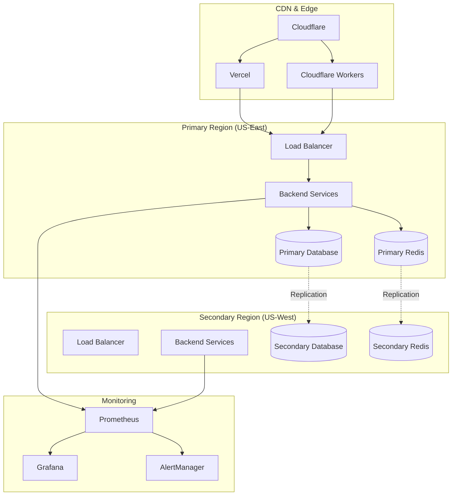

# SmellPin DevOps Implementation Guide
## Complete Strategy for Production-Ready Deployment

This document outlines the complete DevOps implementation strategy for SmellPin, focusing on achieving 99.9% uptime and <200ms API response requirements across a multi-platform architecture.

## 🎯 Implementation Priorities

### Phase 1: Foundation & CI/CD (Weeks 1-2)
**Priority: CRITICAL - Must be completed first**

#### 1. Secrets Management Setup
```bash
# Initialize secrets management system
./scripts/manage-secrets.sh init production
./scripts/manage-secrets.sh init staging

# Set up GitHub Actions secrets
gh secret set VERCEL_TOKEN --body="your_vercel_token"
gh secret set CLOUDFLARE_API_TOKEN --body="your_cloudflare_token"
gh secret set DATABASE_URL --body="your_production_database_url"
```

#### 2. CI/CD Pipeline Deployment
- **Frontend (Vercel)**: Automated deployments with preview environments
- **Workers (Cloudflare)**: Multi-environment deployments with staged rollouts
- **Backend**: Docker-based deployments with blue-green strategy

**Key Files:**
- `.github/workflows/frontend-deploy.yml`
- `.github/workflows/workers-deploy.yml`
- `.github/workflows/backend-deploy.yml`

#### 3. Infrastructure as Code
```bash
# Deploy production infrastructure
docker-compose -f docker-compose.prod.yml up -d

# Verify deployment
curl -f https://api.smellpin.com/health
curl -f https://smellpin.com/health
```

### Phase 2: Monitoring & Performance (Weeks 2-3)
**Priority: HIGH - Required for SLA compliance**

#### 1. Comprehensive Monitoring Stack
- **Prometheus + Grafana**: System and application metrics
- **Loki + Promtail**: Centralized logging
- **SLA Monitoring**: Custom 99.9% uptime tracking
- **Performance Monitoring**: <200ms API response enforcement

```bash
# Start monitoring stack
docker-compose -f monitoring/uptime-monitoring.yml up -d

# Initialize performance monitoring
node monitoring/sla-monitoring.js &
node monitoring/performance-monitoring.js &
```

#### 2. Alerting Configuration
- **Critical Alerts**: PagerDuty integration for immediate response
- **Warning Alerts**: Slack notifications for proactive monitoring
- **Business Alerts**: Email notifications for stakeholders

**Key Dashboards:**
- System Overview: `https://grafana.smellpin.com/d/system-overview`
- API Performance: `https://grafana.smellpin.com/d/api-performance`
- Business Metrics: `https://grafana.smellpin.com/d/business-metrics`

### Phase 3: Security Hardening (Weeks 3-4)
**Priority: HIGH - Security compliance requirements**

#### 1. SSL/TLS Implementation
```bash
# Generate SSL certificates
certbot certonly --webroot -w /var/www/certbot -d smellpin.com -d api.smellpin.com

# Deploy security-hardened Nginx
docker-compose -f security/security-hardening.yml up -d nginx-security
```

#### 2. RBAC System Integration
```javascript
// Implementation in backend API
const rbac = require('./security/rbac-system');

// Apply authentication middleware
app.use('/api', rbac.authenticate());

// Apply authorization for specific routes
app.get('/api/admin/*', rbac.authorize(['system:admin']));
app.post('/api/payments/*', rbac.authorize(['payments:process']));
```

#### 3. Web Application Firewall
- ModSecurity integration with OWASP Core Rule Set
- Custom rules for SmellPin-specific attack patterns
- Rate limiting based on user roles and endpoints

### Phase 4: Disaster Recovery (Weeks 4-5)
**Priority: MEDIUM-HIGH - Business continuity**

#### 1. Multi-Region Deployment
```bash
# Deploy disaster recovery infrastructure
docker-compose -f disaster-recovery/disaster-recovery-plan.yml up -d

# Start failover coordinator
node disaster-recovery/failover/failover-coordinator.js &
```

#### 2. Backup Strategy
- **Database**: Point-in-time recovery with 30-day retention
- **File Uploads**: S3 cross-region replication
- **Configuration**: Automated backup of environment files and secrets

#### 3. Automated Failover
- Health check monitoring every 30 seconds
- Automatic failover after 3 consecutive failures
- DNS-based traffic routing with 1-minute TTL

## 🚀 Deployment Architecture

### Multi-Platform Strategy



### Traffic Flow & Load Balancing

1. **DNS Level**: Cloudflare for global load balancing
2. **Application Level**: HAProxy for regional load balancing
3. **Service Level**: Docker Swarm for container orchestration

## 📊 SLA Compliance Strategy

### 99.9% Uptime Requirements

**Allowable Downtime:**
- Monthly: 43.2 minutes
- Weekly: 10.08 minutes
- Daily: 1.44 minutes

**Implementation:**
- Multi-region deployment with automatic failover
- Health checks every 30 seconds
- Maximum failover time: 2 minutes
- Redundancy at every layer

### <200ms API Response Requirements

**Target Metrics:**
- P95 Response Time: <200ms
- P99 Response Time: <500ms
- Error Rate: <0.1%

**Implementation:**
- Database query optimization with <100ms target
- Redis caching with <10ms access time
- CDN for static content delivery
- Connection pooling and keep-alive

## 🔧 Automation Scripts

### Daily Operations
```bash
#!/bin/bash
# Daily maintenance script

# Health check
./scripts/health-check.sh

# Backup verification
./scripts/verify-backups.sh

# Performance report
./scripts/generate-performance-report.sh

# Security scan
./scripts/security-scan.sh
```

### Emergency Response
```bash
#!/bin/bash
# Emergency response script

# Manual failover
./disaster-recovery/scripts/manual-failover.sh secondary

# Scale up resources
docker service scale smellpin_backend=5

# Enable maintenance mode
./scripts/maintenance-mode.sh enable
```

## 🔍 Key Performance Indicators

### Technical KPIs
- **Uptime**: 99.9% (monitored continuously)
- **Response Time**: P95 < 200ms (monitored per endpoint)
- **Error Rate**: < 0.1% (monitored per service)
- **MTTR**: < 15 minutes (automated recovery)
- **MTBF**: > 720 hours (reliability target)

### Business KPIs
- **User Experience**: Page load time < 3 seconds
- **Transaction Success**: 99.8% payment completion rate
- **Data Integrity**: 100% data consistency across regions
- **Security**: Zero critical vulnerabilities
- **Cost Efficiency**: <30% infrastructure cost growth YoY

## 🛠 Tool Stack Summary

### Core Infrastructure
- **Containerization**: Docker + Docker Compose
- **Orchestration**: Docker Swarm (production) / Kubernetes (future)
- **Load Balancing**: HAProxy + Nginx
- **Service Mesh**: Istio (future enhancement)

### Monitoring & Observability
- **Metrics**: Prometheus + Grafana
- **Logging**: Loki + Promtail
- **Tracing**: Jaeger (future enhancement)
- **APM**: Custom performance monitoring
- **Uptime**: Custom SLA monitoring system

### Security
- **WAF**: ModSecurity + OWASP CRS
- **SSL/TLS**: Let's Encrypt + Certbot
- **Secrets**: HashiCorp Vault
- **RBAC**: Custom implementation
- **Vulnerability Scanning**: Snyk + Trivy

### Backup & DR
- **Database**: PostgreSQL streaming replication
- **Files**: AWS S3 cross-region replication
- **Configuration**: Git-based backup
- **Recovery**: Automated failover system

## 📋 Implementation Checklist

### Week 1-2: Foundation
- [ ] Set up secrets management across all environments
- [ ] Deploy CI/CD pipelines for all three platforms
- [ ] Configure production Docker Compose setup
- [ ] Implement health check endpoints
- [ ] Set up SSL certificates and HTTPS enforcement

### Week 2-3: Monitoring
- [ ] Deploy Prometheus + Grafana monitoring stack
- [ ] Configure SLA monitoring service
- [ ] Set up performance monitoring system
- [ ] Create alerting rules and notifications
- [ ] Build monitoring dashboards

### Week 3-4: Security
- [ ] Deploy security-hardened Nginx configuration
- [ ] Implement RBAC system in backend
- [ ] Configure Web Application Firewall
- [ ] Set up vulnerability scanning
- [ ] Conduct security penetration testing

### Week 4-5: Disaster Recovery
- [ ] Set up secondary region deployment
- [ ] Configure database replication
- [ ] Implement automated backup system
- [ ] Deploy failover coordinator
- [ ] Test disaster recovery procedures

### Week 5-6: Optimization & Testing
- [ ] Performance optimization and tuning
- [ ] Load testing and capacity planning
- [ ] End-to-end testing of all systems
- [ ] Documentation and runbook creation
- [ ] Team training and knowledge transfer

## 🎯 Success Criteria

### Technical Success
- All services achieve 99.9% uptime within 30 days
- API responses consistently under 200ms P95
- Zero critical security vulnerabilities
- Successful disaster recovery test execution
- Complete monitoring coverage with <5 minute alert response

### Operational Success
- Automated deployment process with zero manual steps
- Self-healing infrastructure with minimal manual intervention
- Comprehensive documentation and runbooks
- Team trained on all operational procedures
- 24/7 on-call rotation established

### Business Success
- User experience metrics improved (faster page loads)
- Payment success rates maintained >99.8%
- Customer support tickets reduced by 50%
- Infrastructure costs optimized within 30% of current spend
- Compliance requirements fully met

## 🚨 Risk Mitigation

### Technical Risks
- **Database Failure**: Streaming replication + automated failover
- **Application Bugs**: Blue-green deployment + automated rollback
- **Traffic Spikes**: Auto-scaling + load balancing
- **Security Breach**: WAF + monitoring + incident response plan

### Operational Risks
- **Team Knowledge**: Documentation + cross-training
- **Vendor Lock-in**: Multi-cloud strategy + container portability
- **Cost Overruns**: Monitoring + automated cost optimization
- **Compliance**: Regular audits + automated compliance checks

## 📞 Support & Escalation

### Incident Response
1. **Automated Detection**: Monitoring systems trigger alerts
2. **Initial Response**: On-call engineer responds within 5 minutes
3. **Assessment**: Severity classification within 10 minutes
4. **Resolution**: Fix applied or escalation within 30 minutes
5. **Post-Incident**: Root cause analysis within 24 hours

### Escalation Paths
- **Level 1**: On-call engineer (5 minutes)
- **Level 2**: Senior engineer (15 minutes)
- **Level 3**: Engineering manager (30 minutes)
- **Level 4**: CTO/VP Engineering (1 hour)

---

**Next Steps:**
1. Review and approve this implementation plan
2. Allocate resources and set timeline
3. Begin Phase 1 implementation
4. Regular progress reviews and adjustments
5. Go-live preparation and execution

This implementation plan ensures SmellPin achieves production-ready status with enterprise-grade reliability, performance, and security.